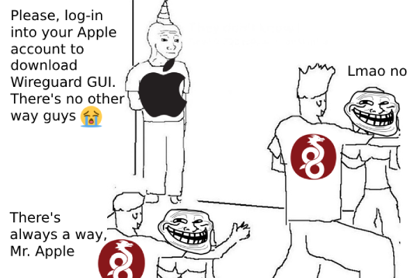

## This is just a reupload of executables

So please, don't open an issue if you're having troubles with the application itself, we can't help with that.
Here's the original repository of this app ([wireguard-apple](https://github.com/WireGuard/wireguard-apple)).
But the devs there has disabled the ability to create issues. So we have no idea how to contact the developers or where to get help if the app doesn't work.

## Why

The MacOS version of the official Wireguard GUI app is only available for download from [App Store](https://apps.apple.com/us/app/wireguard/id1441195209). 
But that requires signing-in into an Apple account. And presumably you don't want to do that (we get you!). 
Or you want to get an older version of the app, which you won't find in the app store. In any case, you're in luck.

Mac applications are sort of like Linux's Appimage apps. They can be simply copied from one machine to another. So go and grab yourself a copy.
See [Installation](#installation).

## Virus scan

The uploaded application files are unchanged and retain their original crypto signature. Here's the VirusTotal scan reports:
- v1.0.16 [report](https://www.virustotal.com/gui/file/df84eab7d5b991164d508c1a4c8596d428a4cf6a20cc201716adc0cf0f6bed75/details)
- v1.0.15 [report](https://www.virustotal.com/gui/file/d31ea7a0441c695db234e4684901acbc8126c05b56e8e19d7ffa4a0305322066/details)

But you should re-check yourself. Don't download from unofficial channels without re-checking that it's not a blatantly obvious virus.

## Versions <= 1.0.14 requested

If you still have an application bundle with a version v1.0.14 or lower, I would be really thankful it you could provide it for archiving so people on the older MacOS versions can get access to Wiregaurd client if need be. 

## Installation

Download the application from the "Releases" section:
- If you have the OS version 12.0+, get [v1.0.16](https://github.com/zakosaba/wireguard-macos-app/releases/tag/v1.0.16)
- If you have an older version (10.14 to 12.0), get [v1.0.15](https://github.com/zakosaba/wireguard-macos-app/releases/tag/v1.0.15)

After the download, extract the application from the archive. And then move it 
into [global or local](https://apple.stackexchange.com/questions/312058/do-applications-install-for-all-users-or-only-for-one) `Applications` directory.
